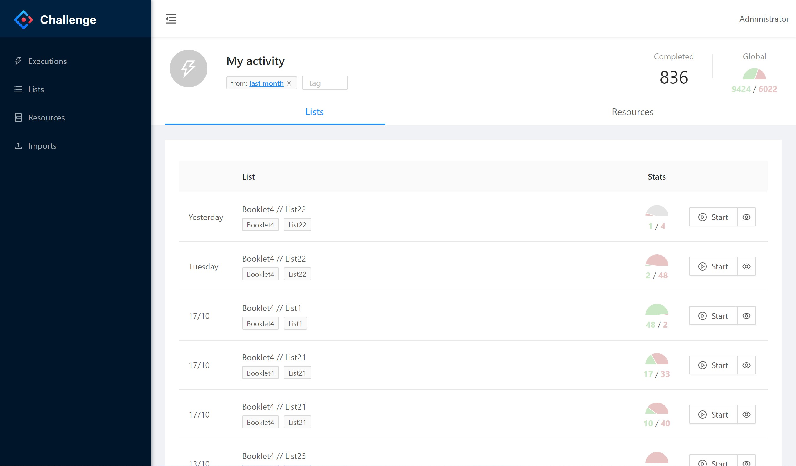

# language-challenger

Training platform for the English language based on Vaughan booklets. The Vaughan booklets are collections of resources (phrases, vocabulary and paragraphs) in English and Spanish. This resources are accompanied with audio for the lisening trainning.

The main goal is monitor the progress of the student based on the successes/errors in the executions of the lists. The student will be able to consult which resources are the ones that fail the most or mark the ones they want as favourites.

## Stack

- Backend: meteorjs + mongodb
- Front: reactjs, less, antd (as component library)
- Tools: storybook, cypress, hygen (for scaffolding), eslint and prettier.

## Other considerations

- Implemented as a SPA.
- `react-route` + Suspense api for code splitting.
- Responsive design. 
- Reactivity: core feature of meteorjs. The UI is always sync throught DDP protocol.

## Code navigation

The core implementation is located in the `import` folder, with de following structure:

- api: backend logic with the typical meteor elements: collections, methods and publications.
- fixtures: fixtures to bootstrap the database.
- modules: functionality shared between front and back.
- ui: ui implementation (react classes and hooks).
- startup: initializing code for client and server

## Installation

* Install [meteor](https://www.meteor.com/)
* Clone the repostory
* `meteor npm install && meteor`
* Enjoy
